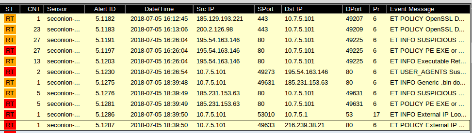
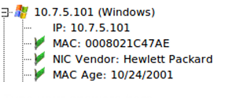
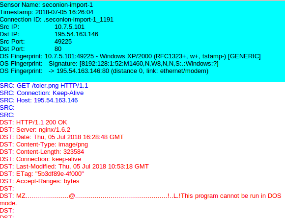
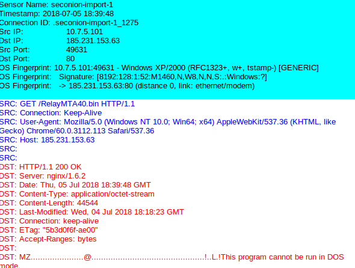
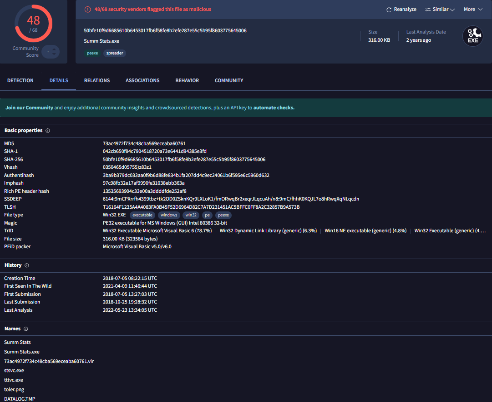
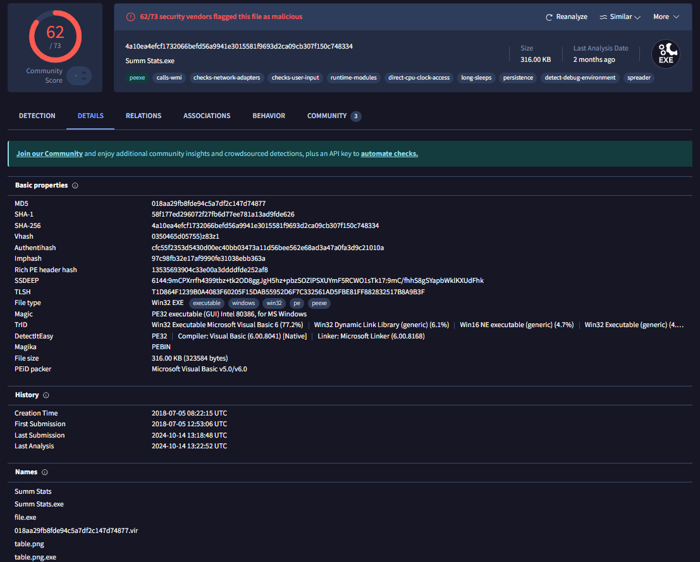
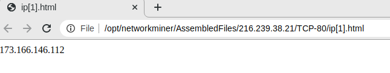
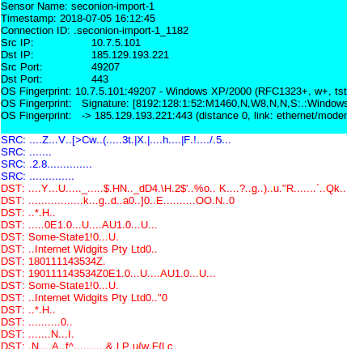
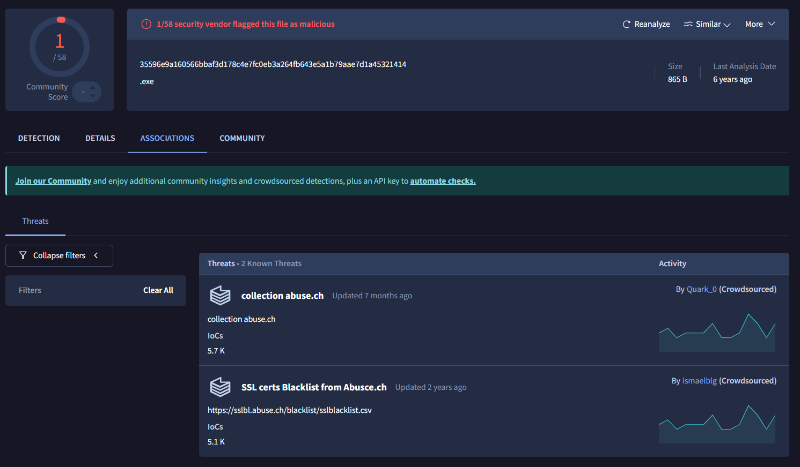

# Incident Response - Cisco CyberOps Final Skills Assessment

For the final assesment of instrutor lead Cisco Cyberops Assoicate, I was tasked with investigating a potential malware infection within a simulated enterprise network. An alert indicated suspicious activity tied to the TrickBot trojan — a well-known multi-stage malware associated with credential theft, ransomware, and command-and-control (C2) operations.

My role was to analyze the timeline of the attack using tools like Sguil and VirusTotal. The investigation involved identifying infected hosts, isolating malicious files, extracting IOC (Indicators of Compromise) data, and tracing external communication with attacker-controlled infrastructure. Through this process, I discovered multiple stages of infection, including reconnaissance, privilege escalation, and data exfiltration, revealing a full-scale compromise originating from a phishing-based PDF delivery.

## Project Highlights
- Investigated malware behavior using Security Onion tools.
- Identified IP addresses and malicious domains involved.
- Analyzed downloaded files and verified hashes using VirusTotal.
- Reported multi-stage malware behavior including C2 communication and data exfiltration.

## Tools Used
- Security Onion (Sguil, Kibana, NetworkMiner)
- VirusTotal
- Oracle VirtualBox
- Internet search intelligence (open-source)

## Key Outcomes
- Mapped the entire infection timeline of TrickBot on a compromised host.
- Detected malicious files used in the campaign (Toler.png, Table.png, RelayMTA40.bin).
- Identified threat infrastructure and attacker-controlled IPs.
- Provided evidence-based findings to inform SOC mitigation response.

---

## Project Steps

### 1. Analyzing Alerts in Sguil & Kibana
Used Sguil and Kibana to identify alerts within the time window of 2018-07-05 16:12 to 18:39 UTC. Recorded alert types, source and destination IPs, and payload indicators.

> **Figure 1:** Analysis of event alerts tied to TrickBot infection timeline.

---

### 2. Identifying Infected Host
Pinpointed the infected machine using IP `10.7.5.101`. Verified MAC address and NIC vendor using NetworkMiner. Established that infection likely came via a phishing-based PDF exploit.

> **Figure 3:** Infected host and network identity details.

---

### 3. Tracking Downloaded Payloads
Observed HTTP GET requests for malicious files: `Toler.png`, `Table.png`, and `RelayMTA40.bin`. Traced domains and IPs involved.

> **Figure 4:** Downloaded malware payloads and command-and-control infrastructure Toler.PNG.

> **Figure 5:** Downloaded malware payloads and command-and-control infrastructure Table.png.

> **Figure 6:** Downloaded malware payloads and command-and-control infrastructure RelayMTA40.bin.

---

### 4. Verifying File Hashes with VirusTotal
Extracted SHA256 hashes and submitted to VirusTotal. Confirmed each file was malicious with detailed community and vendor reports.

> **Figure 7:** Threat intelligence report of Toler.png via VirusTotal.

> **Figure 8:** Threat intelligence report of Table.png via VirusTotal.

> **Figure 9:** Threat intelligence report of RelayMTA40.bin via VirusTotal.

---

### 5. Reporting Findings
Documented a full infection lifecycle: from phishing to execution, C2 beaconing, and exfiltration. Noted hidden indicators and possible persistence mechanisms (e.g., hidden IPs, certificate abuse).

> **Figure 10:** Hidden IP.

> **Figure 11:** Suspicious Certificate.

> **Figure 12:** Certificate virutotal result.

---

> _"Analyzing adversary footprints to strengthen digital defense."_
